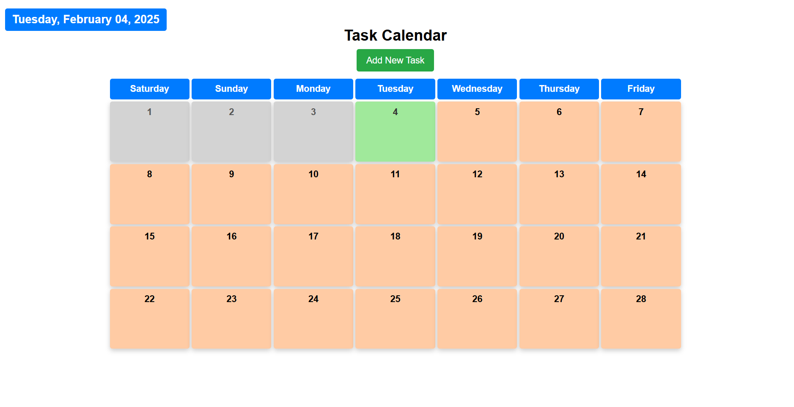
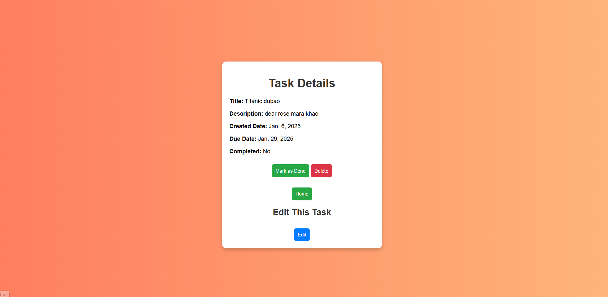
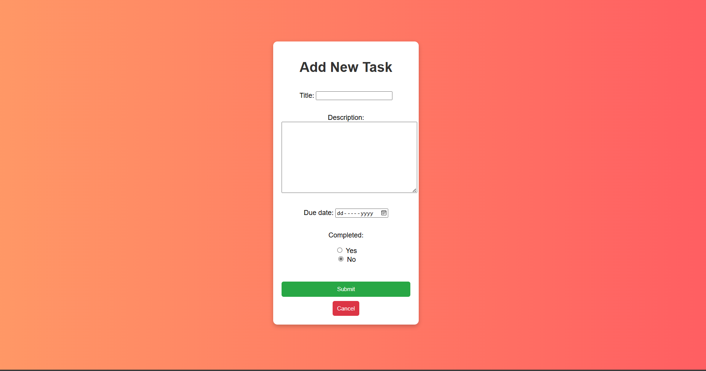

# Scheduling_Calender

This is a **Django-based To-Do List application** that integrates a **calendar view** to help users manage their tasks effectively. Users can **add, view, complete, and delete tasks** while navigating through different months using the calendar interface.

---

## 📌 Features
✅ Task Management (Add, View, Edit, Complete, Delete)  
✅ Fullscreen Calendar with **Task Scheduling**  
✅ Tasks are color-coded based on completion status  
✅ **Responsive Design** for desktop and mobile  

---

##  🛠️ Technologies Used
 ✅ Python & Django (Backend)
 
 ✅ HTML, CSS (Frontend)
 
 ✅ SQLite (Default Database)
 
 ✅ Bootstrap / Custom Styling

##  Home page

## Task details page

## Task editing page

